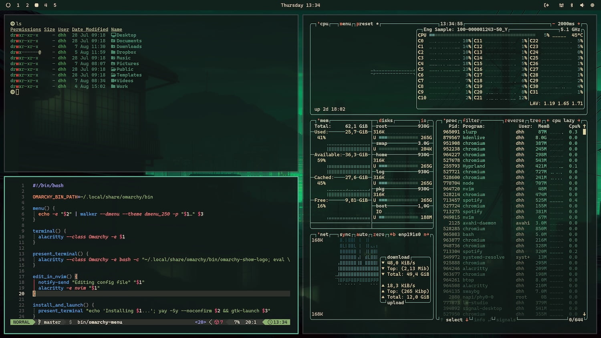

# Osaka Jade - Theme for Omarchy

Osaka Jade is now a default theme on [Omarchy](https://omarchy.org).
You do not need to install Osaka Jade, you can set it using the Omarchy menu.

The [Omarchy Git Hub](https://github.com/basecamp/omarchy) will have the latest updates.


## Set Theme to Osaka Jade (Recommended)
1. Click `SUPER + ALT + SPACE`
2. Click `Style`
3. Click `Theme`
4. Select `Osaka Jade`

#### Install with GUI:
1. Copy `https://github.com/Justikun/omarchy-osaka-jade-theme`
2. Click `SUPER + ALT + SPACE`
3. Click `Install`
4. Click `Theme`
5. Paste the link 

#### Install with Bash:
```bash
omarchy-theme-install https://github.com/Justikun/omarchy-osaka-jade-theme.git
```

## Preview



